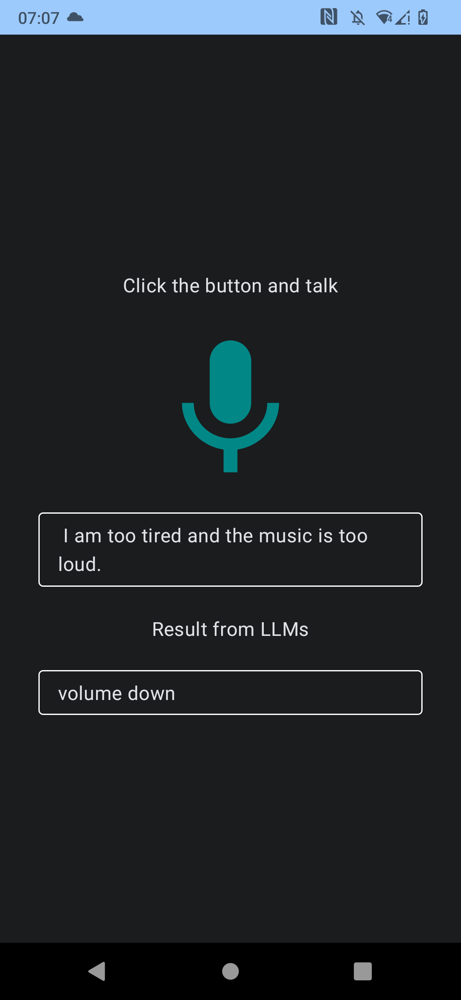

# Talk and execute

This is an implementation showcasing offline usage of the [Whisper model](https://github.com/openai/whisper) within an Android application.
It is a small Poc of an assistant using LLMs.

More information at this [Medium](https://medium.com/p/3165976d753d) blog post.

 

