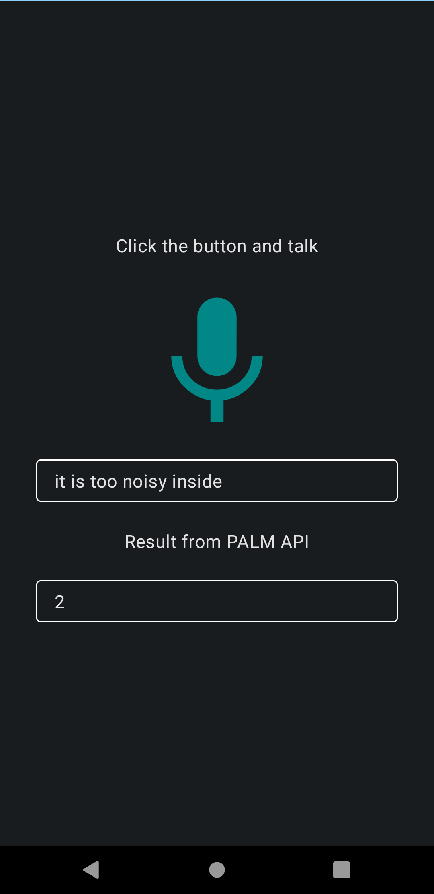

# Talk and execute

This is an implementation showcasing the seamless integration of Google’s [Speech Recognizer](https://developer.android.com/reference/android/speech/SpeechRecognizer) and [PALM API](https://developers.generativeai.google/) within a unified Android application.

More information at this [Medium](https://farmaker47.medium.com/using-palm-api-inside-android-eb34bada76e1) blog post.

 

